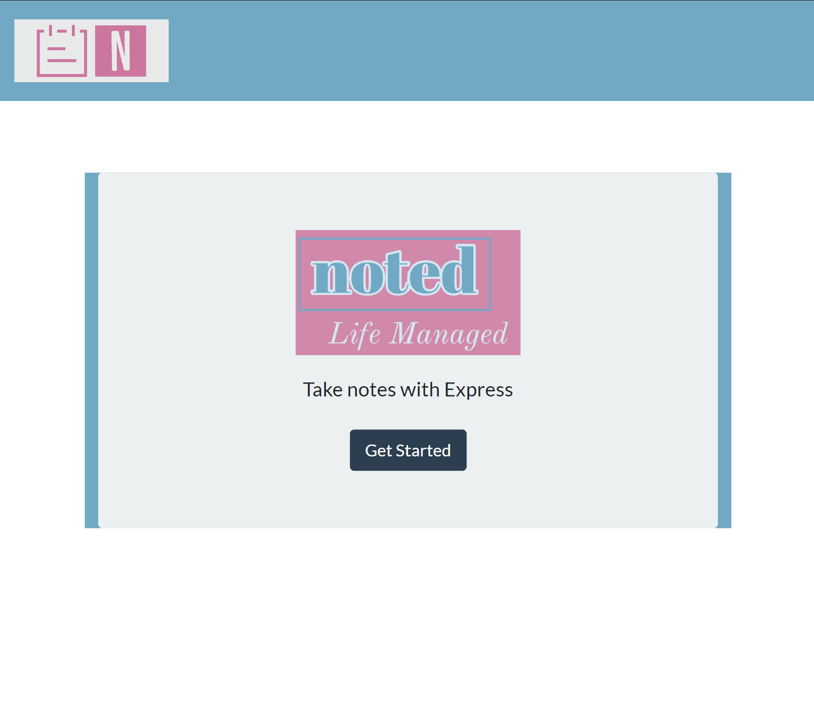
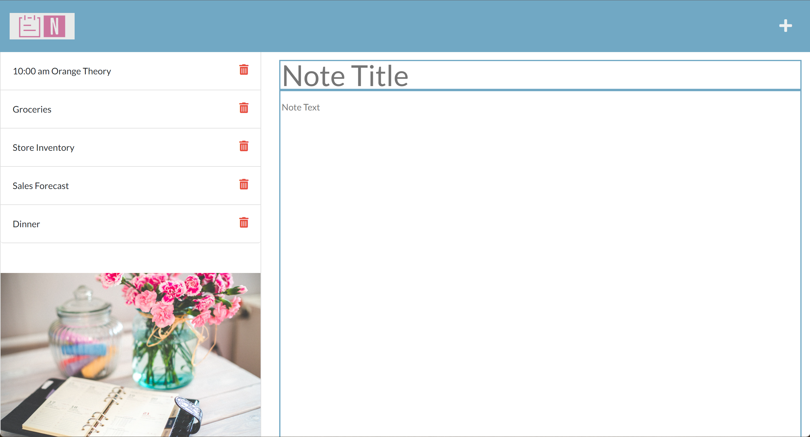
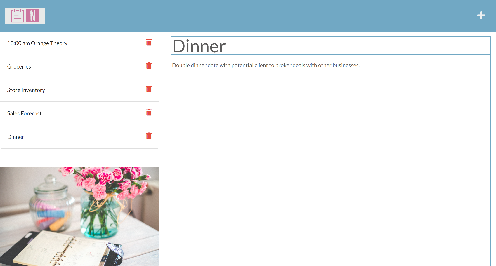
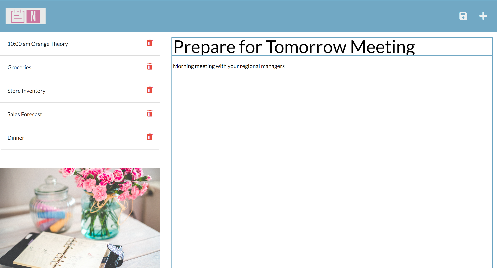

# Noted
[](https://opensource.org/licenses/ISC)

## Description
Noted application uses Express.js back end and saves and retrieves note data from a JSON file. Application is deployed in Heroku.

Use Case
As a small business owner, I am able to write and save notes so that I can organize my thoughts and keep track of tasks I need to complete.

## My Links
[My Deployed Application Site](https://noted-mewing0328.herokuapp.com/)

[GitHub Repository](https://github.com/mewing0328/Noted)

## Table of Contents
[1. Installation](#installation)

[2. Usage](#usage)

[3. Contributing](#contributing)

[4. Questions](#questions)

[5. License](#license)

[6. Screenshots](#screenshots)

[7. Credits](#credits)

## Installation 
The application has dependencies (see package.json file). Before using the application, install npm modules.

```bash
npm install
```

## Usage 
The application will be invoked by using the following command:

```bash
node server.js
```

```
The note-taking appliction: 
- When opened, Noted presents a landing page with a link to a notes page
- When clicked on the link to the notes page, then the user is presented with a page with existing notes listed in the left-hand column, plus empty fields to enter a new note title and the note's text in the right-hand column.
- When the user enters a new note title and the note's text, then a Save icon appears in the navigation at the top of the page.
- When he user clicks on the Save icon, then the new note the user entered is saved and appears to the left-hand column with the other existing notes.
- When the user clicks on an existing note in the left-hand column list, then that note appears in the right-hand column.
- When the user clicks on the Write icon in the navigation at the top of the page, then the user is presented with empty fields to enter a new note title and the note's text in the right-hand column. 
- Noted's front end connects to an Express.js back end.
- Noted's back end stores notes that have a unique id in a JSON file.
- Noted is deployed to Heroku.
- Noted allows users to delete notes.

```

## Contributing 
Contributions are welcomed for future versions with features such as:
- Making existing saved notes editable
- additional enhancements

For all contributions, please refer to [Contributor Covenant Code of Conduct](https://www.contributor-covenant.org/version/2/1/code_of_conduct/code_of_conduct.md) for contributing guidelines.

<br>

## Questions
Interested in seeing my other work?

Check out my GitHub account: [mewing0328](https://github.com/mewing0328).

If you have additional questions, please reach me at [masandraewing@gmail.com](mailto:masandraewing@gmail.com).

<br>

## License 
Noted project is covered by ISC license. 

 To view the most current and full license description in opensource.org, click on the license name below.  

 [](https://opensource.org/licenses/ISC)

<br>

 ## Screenshots 
Utilized Visual Studio Code

1. Main Page - User will click on Get Started button

    

2. Notes page with a new note ready for entry

    

3. Saved note clicked on the left and appears on the right

    

4. New note with the save icon appearing on the top right corner

    

<br>

## Credits
Credit for tutorials and guides I utilized in my code

[Bootstrap](https://getbootstrap.com/): CSS styling

[npm: Express](https://www.npmjs.com/package/express): Utilized for back end

[npm: UUID](https://www.npmjs.com/package/uuid): Generate random ids 

[path in node.js](https://www.javascripttutorial.net/nodejs-tutorial/nodejs-path-module/#:~:text=in%20Node.js-,Node.,a%20core%20module%20in%20Node.): Guide for path

[pixabay](https://pixabay.com/): Images rendered on the html page

[Adobe Logo Express Maker](https://express.adobe.com/express-apps/logo-maker): Utilized to create a custom logo for the application

[heroku Docs](https://devcenter.heroku.com/articles/getting-started-with-nodejs?singlepage=true): Guide to integrate Noted repo with Heroku
